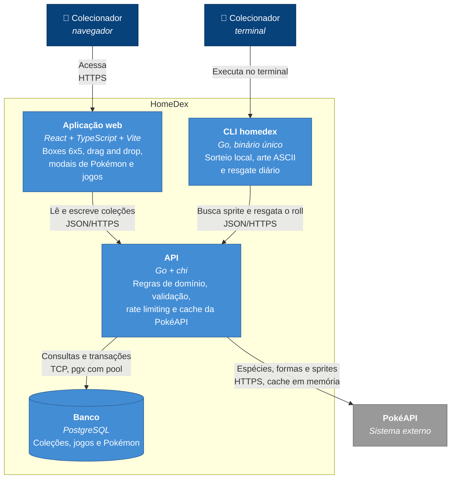

# C4 nível 2 — Containers

Como o HomeDex se divide em unidades executáveis e como elas conversam. O contexto de fora está no [diagrama de contexto](context.md).

## Containers

| Container | Tecnologia | Onde roda | Responsabilidade |
| --------- | ---------- | --------- | ---------------- |
| Aplicação web | React, TypeScript, Vite, CSS Modules, React Query, Zod, dnd-kit | Static Site no Render | Toda a interface do produto. Nenhum componente faz `fetch` direto: componente → hook → serviço. A URL da API entra no bundle em tempo de build, via `VITE_API_URL`. |
| API | Go, chi, pgx | Web Service (Docker) no Render | Único lugar com regras de domínio e único que fala com o banco e com a PokéAPI. Responde JSON, valida entrada, limita taxa por IP e serve as sprites por proxy com cache. |
| CLI `homedex` | Go, módulo próprio em `cli/` | Máquina do usuário | Sorteia offline entre os 151 de Kanto (dataset compilado no binário), renderiza a sprite em ASCII e conversa com a API só para buscar a imagem e resgatar o Pokémon do dia. |
| Banco | PostgreSQL | Neon | Coleções, jogos e Pokémon. Sprites **não** são armazenadas — só o suficiente para reconstruí-las (espécie, forma, shiny). |

## Conversas entre containers

| De | Para | Protocolo | Para quê |
| -- | ---- | --------- | -------- |
| Aplicação web | API | JSON sobre HTTPS | `/collections`, `/collections/{code}/boxes`, `/collections/{code}/games`, `/collections/{code}/pokemons`, `/pokemon-forms`, `/sprite` |
| CLI | API | JSON sobre HTTPS | `GET /sprite/image` (timeout de 3s) e `POST /collections/{code}/daily-roll` (timeout de 5s) |
| API | Banco | TCP, pgx com pool | Consultas e transações. O pool é configurado para o scale-to-zero do Neon — [ADR 0001](../adr/0001-banco-de-dados-no-neon.md) |
| API | PokéAPI | HTTPS | Espécies, formas e bytes das sprites, com cache em memória por processo |

## Invariantes de arquitetura

Regras que o diagrama existe para tornar visíveis, e que valem em qualquer mudança futura:

- **Só a API fala com a PokéAPI.** Nem o frontend nem a CLI a chamam direto. Isso concentra o cache, mantém uma única política de rede e evita expor o usuário à instabilidade de um terceiro.
- **Só a API fala com o banco.** Frontend e CLI não têm connection string nem noção do schema.
- **Frontend e backend são aplicações separadas**, que se comunicam exclusivamente por HTTP — não há build compartilhado nem código em comum entre os dois.
- **A CLI não confia no próprio relógio.** O limite de um resgate por dia UTC é decidido no banco, dentro da transação — [ADR 0004](../adr/0004-transacao-atomica-do-resgate-diario.md).
- **`backend/` e `cli/` são módulos Go independentes**, ligados localmente pelo `go.work` só para desenvolvimento; nenhum dos dois importa o outro em produção.
