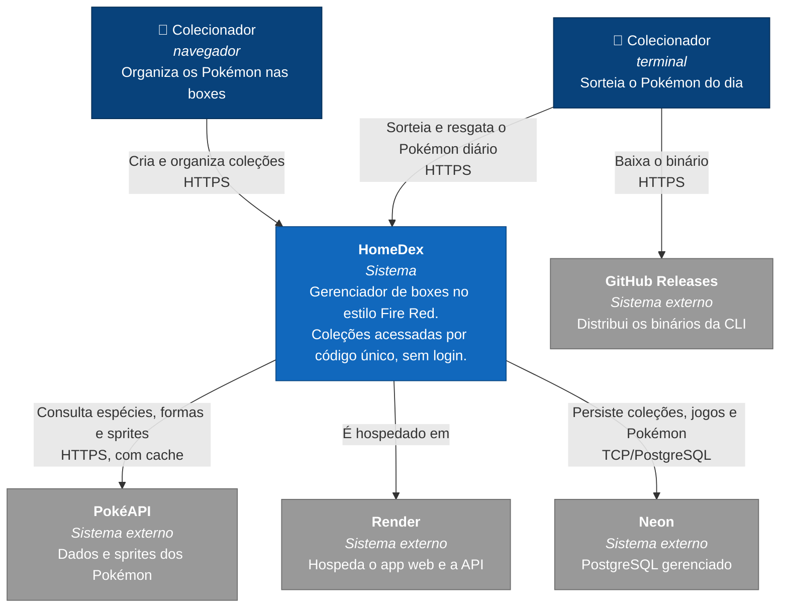

# C4 nível 1 — Contexto do sistema

Quem usa o HomeDex e de que sistemas externos ele depende. O detalhe interno fica no [diagrama de containers](container.md).

## Atores

| Ator | Descrição |
| ---- | --------- |
| Colecionador (navegador) | Cria uma coleção ou recupera a dela pelo código de 8 caracteres, adiciona e organiza Pokémon nas boxes, gerencia jogos e HackRoms. Não existe cadastro nem login: o código **é** a credencial. |
| Colecionador (terminal) | Usa a CLI `homedex` para sortear um Pokémon aleatório de Kanto e, se quiser, resgatá-lo para a coleção — um por dia UTC. É a mesma pessoa do ator acima, por outra porta de entrada. |

## Sistemas externos

| Sistema | Papel | Observações |
| ------- | ----- | ----------- |
| PokéAPI | Fonte de dados de espécies, formas e sprites | Chamada **apenas** pelo backend, nunca pelo frontend ou pela CLI. As respostas são cacheadas em memória para não repetir a ida à rede a cada visualização. |
| Render | Hospedagem do app web (Static Site) e da API (Web Service) | Declarado em `render.yaml` — [ADR 0006](../adr/0006-infraestrutura-declarada-em-render-yaml.md). |
| Neon | PostgreSQL gerenciado | Fora do Render por causa da expiração de 90 dias do banco gratuito de lá — [ADR 0001](../adr/0001-banco-de-dados-no-neon.md). |
| GitHub Releases | Distribuição dos binários da CLI | Publicados pelo GoReleaser quando a tag de release é criada — [ADR 0003](../adr/0003-token-do-release-please.md). |
